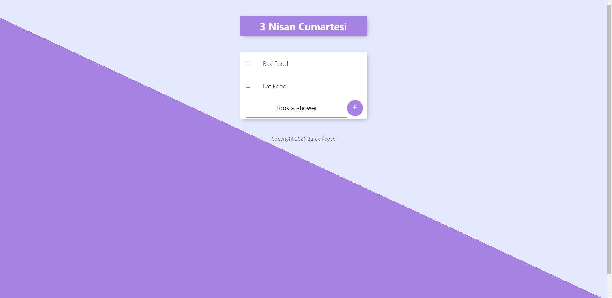
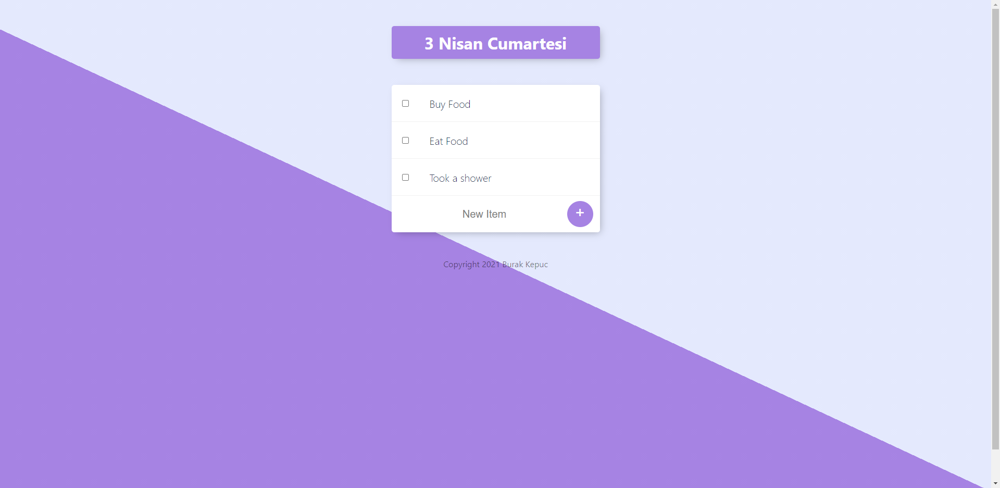

                  # To-Do-List-EJS
                  
To-Do List project by Web development course instructor Angela Yu.   
I use mainly EJS which is embedded javascipt template.  
By using **EJS**, you can directyle write js code in Html.  
Another tech stacks are : **Html,Css,Javascript,Node Js, Express js, npm body-parser and Terminal.**  

I learned about get-post request from html form, rendering html files into nodejs server,nextjs templating and gain knowledge about javascript.  

Documentation EJS: https://ejs.co/  
Images :  

UPGRADE: Todolist was connected nosql database. I have used mongodb,mongoose.
Tech I gain comfortable : MongoDB,Mongoose,Lodash.
